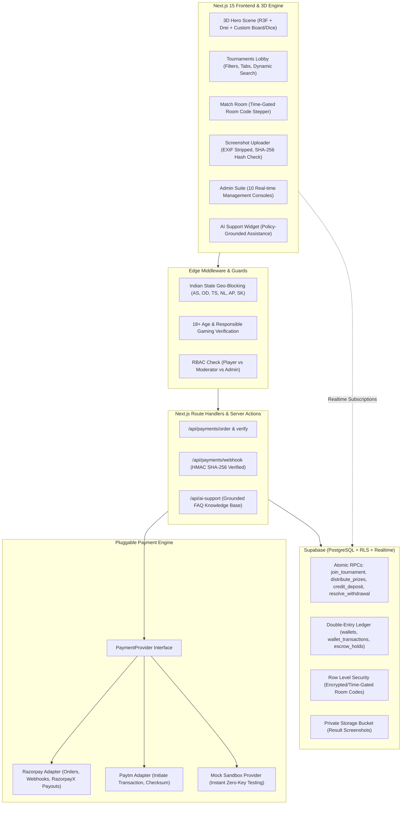

# 🎲 LudoArena — 3D Esports Tournament Platform

[](https://nextjs.org)
[](https://www.typescriptlang.org)
[](https://threejs.org)
[](https://tailwindcss.com)
[](https://vitest.dev)

A complete, production-ready, modern **3D esports-style tournament platform** for Ludo-style room-code games. Players join tournaments, receive secure time-gated room codes, compete in external apps, upload result screenshots, and claim verified prize pool distributions directly into their double-entry wallets.

---

## 🏛️ System Architecture



---

## 📦 Features Overview

### 1. 3D Esports Experience
- **Interactive Three.js / R3F Hero Scene:** Fully procedural 3D Ludo board with 4 colored home zones, star tokens, center victory pyramid, particle stars, and a clickable 3D dice that rolls with realistic easing.
- **Adaptive Performance:** Dynamic pixel-ratio clamping (`[1, 1.8]`), low-poly geometry, and a high-performance 2D SVG/CSS fallback for low-end mobile devices and `prefers-reduced-motion`.

### 2. User Authentication & Profile Security
- **Dual Auth Modes:** Email + password authentication and phone OTP login.
- **Security Safeguards:** Rate-limited OTP resend countdowns, password strength meter, duplicate device/IP fingerprint logging, and automated DB triggers creating wallets and referral codes.
- **Compliance Gates:** Mandatory 18+ age checkbox, Terms & Conditions acceptance, and state-level geo-blocking (`BLOCKED_REGIONS`).

### 3. Atomic Tournament Join System
- **Race-Safe Execution:** Single transaction PostgreSQL RPC (`join_tournament`) locks rows with `SELECT ... FOR UPDATE`, checks capacity, verifies registration windows, and debits fees into an **escrow hold**.
- **Auto-Refunds:** Leaving prior to registration close triggers an instant ledger reversal. If minimum player count is not met by start time, the tournament is automatically canceled and all entry fees are refunded.
- **Live Realtime Tracking:** Slot count and player badges update in real-time.

### 4. Time-Gated Room Code Reveal
- **Zero Leakage:** Room codes are strictly hidden at both the RLS policy and API layer until `start_time - ROOM_CODE_REVEAL_MINUTES_BEFORE_START` (default 10 minutes).
- **Match Room UX:** Features a copyable code card, "Open Game App" deep links, live status stepper (Joined → Room Ready → Playing → Submit Result → Verified), and full audit logging of code access.

### 5. Match Result Upload & Anti-Abuse
- **Image Integrity:** Validates MIME types, limits uploads to 5 MB, strips EXIF metadata, and computes SHA-256 hashes to detect duplicate or recycled screenshots across the platform.
- **Dispute Resolution Flow:** Conflicting player claims automatically trigger a `DISPUTED` state and generate an internal support ticket with attached evidence.
- **Side-by-Side Admin Queue:** Admin verification dashboard presents side-by-side player screenshots, claimed positions, conflict warnings, and a one-click winner selector that triggers atomic prize payouts.

### 6. Double-Entry Wallet & Escrow Ledger
- **Three-Bucket Balances:** `deposit_balance`, `winnings_balance`, and `bonus_balance`.
- **Spending Priority:** Entry fees automatically consume bonus balance (up to 20%), then deposit balance, and finally winnings balance.
- **Strict Withdrawals:** Only `winnings_balance` is withdrawable, gated behind approved KYC and automated cooldowns.
- **Audit-Ready Ledger:** Every movement generates an immutable, append-only `wallet_transactions` record.

### 7. Dual Payment Gateway Integration
- Clean `PaymentProvider` interface with runtime resolver:
  - **Razorpay Adapter:** Standard Checkout orders, HMAC SHA-256 webhook validation, and RazorpayX instant payouts.
  - **Paytm Adapter:** Initiate Transaction flow and checksum verification.
  - **Mock Sandbox Provider:** Built-in provider allowing complete end-to-end deposit/withdrawal testing without live merchant keys.

### 8. Complete 10-Console Admin Suite
1. **Overview Dashboard:** Live KPIs, 7-day revenue/volume chart (Recharts), and quick-action alert queues.
2. **Tournaments Manager:** Create, edit, publish, manually cancel/refund, and assign room codes.
3. **Tournament Creator:** Full wizard supporting 1v1, 2-Player, 4-Player, Quick, and Classic modes with custom prize tables.
4. **Result Verification Queue:** Side-by-side screenshot comparisons, winner assignment, and automated prize release.
5. **User Directory & Strike System:** Detailed player profiles, ban/unban controls, strike allocation, and audited wallet adjustments.
6. **Withdrawals Approvals:** Review payout requests, copy UPI/Bank credentials, approve payouts, or reject with automatic wallet balance restoration.
7. **Payment Logs & Reconciliation:** Live log of deposit orders, gateway status, and webhook payloads.
8. **KYC Document Verification:** PAN card and Aadhaar proof inspection with photo previews, rejection reasons, and approval status.
9. **Referral Fraud Monitoring:** Multi-account IP/device cluster detection to identify and void fraudulent referral networks.
10. **System Settings & Audit Log:** Platform fee percentage, minimum/maximum limits, regional blocks, kill switches, and immutable action audit logs.

### 9. 24/7 AI Support Chatbot & Helpdesk
- **Grounded AI Assistant:** Floating chatbot modal grounded in platform policies (room codes, KYC verification, refund terms, withdrawal criteria).
- **Ticketing System:** Users submit support tickets with category tags; admins review, update status, and reply directly from `/admin/support`.

---

## 🛠️ Tech Stack

| Layer | Technology |
| :--- | :--- |
| **Framework** | Next.js 15 (App Router with Server Actions & Route Handlers) |
| **Language** | TypeScript (Strict mode enabled) |
| **3D Rendering** | React Three Fiber (R3F) + `@react-three/drei` + Three.js |
| **Styling** | Tailwind CSS + CSS Variables + Glassmorphism Tokens |
| **State Management** | Zustand (Client UI & Mock Datastore) + TanStack Query |
| **Database & Auth** | Supabase (PostgreSQL, Row Level Security, Storage, Realtime) |
| **Validation** | Zod (Schemas for tournaments, auth, payments, KYC) |
| **Form Handling** | React Hook Form |
| **Data Visualization**| Recharts (Dynamically imported for SSR compatibility) |
| **Testing** | Vitest (13 comprehensive unit tests passing) |

---

## 🚀 Quickstart & Setup

### 1. Prerequisites
- **Node.js:** v18.18.0 or v20+ recommended
- **npm:** v9+ or v10+

### 2. Installation
```bash
# Clone the repository
git clone https://github.com/your-username/ludo-arena.git
cd ludo-arena

# Install dependencies
npm install
```

### 3. Environment Configuration
Copy `.env.example` to `.env.local`:
```bash
cp .env.example .env.local
```

Edit `.env.local` to customize keys:
```env
# Application Brand & Environment
NEXT_PUBLIC_APP_NAME="LudoArena"
NEXT_PUBLIC_APP_URL="http://localhost:3000"
NEXT_PUBLIC_MONEY_MODE="coins"  # "coins" or "real"

# Supabase Credentials
NEXT_PUBLIC_SUPABASE_URL="https://your-project.supabase.co"
NEXT_PUBLIC_SUPABASE_ANON_KEY="eyJhbGciOi..."
SUPABASE_SERVICE_ROLE_KEY="eyJhbGciOi..."

# Active Payment Provider ("mock" | "razorpay" | "paytm")
PAYMENT_PROVIDER="mock"

# Razorpay Keys (Required if PAYMENT_PROVIDER="razorpay")
RAZORPAY_KEY_ID="rzp_test_placeholder"
RAZORPAY_KEY_SECRET="rzp_secret_placeholder"
RAZORPAY_WEBHOOK_SECRET="whsec_placeholder"

# Paytm Keys (Required if PAYMENT_PROVIDER="paytm")
PAYTM_MID="mock_mid"
PAYTM_MERCHANT_KEY="mock_mkey"
```

### 4. Running the Development Server
```bash
npm run dev
```
Open [http://localhost:3000](http://localhost:3000) in your browser.

---

## 💳 Razorpay TEST Mode Guide

To test deposits and payouts using Razorpay Sandbox:

1. Sign up at [Razorpay Dashboard](https://dashboard.razorpay.com/) and navigate to **Settings → API Keys**.
2. Generate your **Test Key ID** and **Test Key Secret**.
3. In `.env.local`:
   ```env
   PAYMENT_PROVIDER="razorpay"
   NEXT_PUBLIC_MONEY_MODE="real"
   RAZORPAY_KEY_ID="rzp_test_YOUR_KEY_ID"
   RAZORPAY_KEY_SECRET="YOUR_KEY_SECRET"
   RAZORPAY_WEBHOOK_SECRET="YOUR_WEBHOOK_SECRET"
   ```
4. **Test Payment Credentials:**
   - **UPI / QR:** Enter any virtual VPA like `success@razorpay` to simulate an approved payment.
   - **Cards:**
     - Card Number: `4111 1111 1111 1111`
     - Expiry: Any future date (e.g. `12/28`)
     - CVV: `123`
     - OTP: `123456`
   - **Netbanking:** Select any test bank (HDFC, SBI, ICICI) and choose "Success" on the simulated bank page.
5. **Webhook Testing:** Set your webhook endpoint to `https://<your-domain>/api/payments/webhook` with the secret configured above and select the `payment.captured` and `payout.processed` events.

---

## 🗄️ Supabase Database Setup

All database migrations are located in `supabase/migrations/`:

```
supabase/migrations/
├── 001_initial_schema.sql         # 26 tables, views, enums & foreign keys
├── 002_functions_and_triggers.sql # Atomic functions & balance management RPCs
├── 003_rls_policies.sql           # Strict Row Level Security policies
└── 004_seed_data.sql              # Super admin, 10 demo users & 12 tournaments
```

### Execution Order in Supabase SQL Editor:
1. Run `001_initial_schema.sql` to instantiate the schema, tables, and views.
2. Run `002_functions_and_triggers.sql` to create atomic functions (`join_tournament`, `leave_tournament`, `distribute_prizes`, `credit_deposit`, `request_withdrawal`).
3. Run `003_rls_policies.sql` to enforce security rules and time-gated room code reveals.
4. Run `004_seed_data.sql` to seed tournaments, sample users, and demo wallets.

---

## 🧪 Test Suite & Validation

Run the automated test suite with:
```bash
# Run unit tests
npm test

# Run TypeScript type check
npx tsc --noEmit

# Run production build
npm run build
```

### Test Coverage Highlights:
- ✅ **Wallet Ledger Invariants:** Bonus balance consumption caps (20%), non-negative balance constraints, and winnings-only withdrawal gating.
- ✅ **Tournament Join System:** Capacity bounds, double-join rejection, registration window checks, and atomic escrow balance reservation.
- ✅ **Prize Distribution:** 1st/2nd/3rd split calculations, platform fee deductions (10%), and idempotent winner payouts.
- ✅ **Payment Webhook Verification:** HMAC SHA-256 signature verification and timing-safe equality checks.

---

## 📋 Requirements Traceability Table

| # | User Requirement | Implementation Files / Routes | Status |
| :--- | :--- | :--- | :---: |
| 1 | **Neutral Brand & Global Config** | `/config/app.config.ts`, `lib/utils.ts` | ✅ Done |
| 2 | **Money Mode Switch ("coins" / "real")** | `/config/app.config.ts`, `app/wallet/page.tsx`, `components/layout/Navbar.tsx` | ✅ Done |
| 3 | **Compliance & Geo-Blocking** | `middleware.ts`, `/responsible-play`, `/terms`, `/privacy`, `/refund-policy` | ✅ Done |
| 4 | **3D Interactive Scene (Board & Dice)** | `components/3d/Dice3D.tsx`, `LudoBoard3D.tsx`, `LudoScene.tsx`, `SceneFallback.tsx` | ✅ Done |
| 5 | **Responsive Design System** | `tailwind.config.ts`, `components/ui/*`, `components/layout/MobileNav.tsx` | ✅ Done |
| 6 | **Auth & Profiles** | `/login`, `/signup`, `/verify-otp`, `/forgot-password`, `/profile` | ✅ Done |
| 7 | **Atomic Tournament Join & Escrow** | `supabase/migrations/002_*.sql`, `tests/unit/tournament-join.test.ts`, `/tournaments/[id]` | ✅ Done |
| 8 | **Time-Gated Room Code Sharing** | `supabase/migrations/003_*.sql`, `app/match/[id]/page.tsx` | ✅ Done |
| 9 | **Match Result Upload & Hash Check** | `app/match/[id]/page.tsx`, `app/admin/results/page.tsx` | ✅ Done |
| 10 | **Dispute Resolution Flow** | `app/match/[id]/page.tsx`, `app/admin/results/page.tsx`, `supabase/migrations/001_*.sql` | ✅ Done |
| 11 | **Double-Entry Wallet System** | `lib/store/useAppStore.ts`, `supabase/migrations/001_*.sql`, `tests/unit/wallet.test.ts` | ✅ Done |
| 12 | **Deposit & Withdrawal Gating** | `app/wallet/add/page.tsx`, `app/wallet/withdraw/page.tsx`, `app/kyc/page.tsx` | ✅ Done |
| 13 | **Pluggable Payment Gateways** | `lib/payments/*` (Razorpay, Paytm, Mock Sandbox), `/api/payments/*` | ✅ Done |
| 14 | **Referral Engine & Fraud Detection** | `/referrals/page.tsx`, `app/admin/referrals/page.tsx` | ✅ Done |
| 15 | **Realtime Leaderboard** | `app/leaderboard/page.tsx` (Daily, Weekly, All-Time Podiums) | ✅ Done |
| 16 | **Complete 10-Console Admin Panel** | `app/admin/*` (Overview, Tournaments, Results, Users, Withdrawals, Payments, KYC, Referrals, Settings, Audit Log) | ✅ Done |
| 17 | **24/7 AI Support Chatbot & Desk** | `components/support/ChatbotWidget.tsx`, `/api/ai-support/route.ts`, `app/support/*`, `app/admin/support/*` | ✅ Done |
| 18 | **Unit Tests & SSR Safety** | `tests/unit/*`, `components/admin/VolumeChart.tsx`, `types/three-jsx.d.ts` | ✅ Done |

---

## 📄 License
This project is proprietary and built for high-performance esports tournament administration. All rights reserved.
